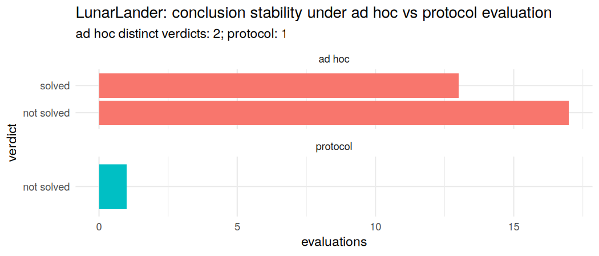
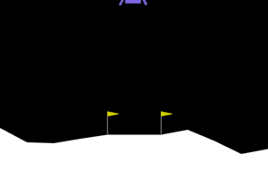

<!-- README.md is generated from README.Rmd. Please edit that file -->

# operantlunar

<!-- badges: start -->

[](https://github.com/sondreskarsten/operantlunar/actions/workflows/R-CMD-check.yaml)
<!-- badges: end -->

`operantlunar` is a native-R instrument for studying
reinforcement-learning agents with the methods of the experimental
analysis of behaviour. It began as a mechanism to **differentiate
reward-maximizing control** (the law of effect) **from descriptive
melioration** (the matching law) on a single shared learning skeleton,
and has grown into a broader toolkit: applied-behaviour-analysis (ABA)
framings of RL problems on the Gymnasium contract, and a
**methodological protocol** that makes a behavioural conclusion about an
agent invariant to researcher degrees of freedom — demonstrated both on
a functional-analysis task and on a verified LunarLander solve. It ships
with an optional Python LunarLander environment via `reticulate` and a
bundled Shiny app, and is built to develop and deploy from RStudio.



## Installation

``` r
# install.packages("devtools")
devtools::install_github("sondreskarsten/operantlunar")
```

In RStudio, open the project and use the **Build** pane (Install, Check,
Document). The package is native R; the Python LunarLander environment
is optional and only needed for the `lunar_setup()` / `differentiate()`
path.

## Quickstart: watch a solved policy land

The package bundles a verified-solved PPO policy (true mean ~243 over
200 terrains) and a runnable example that renders it landing. Run:

``` r
source(system.file("examples", "lunar_quickstart.R", package = "operantlunar"))
```

It loads the bundled policy, runs an episode well above the solved
threshold, and writes `lunar_solved.gif`:



The example drives Gymnasium through `reticulate`; the environment and
`stable-baselines3` are provisioned on first use, or point
`lunar_setup("/path/to/python")` at an interpreter that already has
`gymnasium[box2d]`, `stable-baselines3` and `pillow`.

## What it does

Everything runs on one learning skeleton — `make_table()`,
`run_episode()`, `run_training()`, `evaluate_policy()` — which is agent-
and environment-agnostic. Only the **update rule** and the
**environment** change. Three layers build on it.

### 1. Maximization vs melioration — the namesake

A rule that bootstraps future value and selects greedily *maximizes*; a
myopic linear-operator preference with probability-matching selection
*meliorates*. Both expose the same `select` / `update` / `greedy` /
`action_dist` interface.

``` r
library(operantlunar)
a <- td_agent()           # Q-learning: bootstrap + epsilon-greedy   -> maximizes
b <- melioration_agent()  # gradient-bandit preference, prob matching -> meliorates
```

The operant battery isolates the contexts where the two diverge:

| Lever                     | Function                        | What it isolates                                   |
|---------------------------|---------------------------------|----------------------------------------------------|
| Matching positive control | `fit_generalized_matching()`    | both rules reproduce matching on concurrent VI     |
| Melioration trap          | `melioration_trap_experiment()` | the temporal-credit axis: optimum ≠ matching point |
| Schedule family           | `schedule_matching_table()`     | VI grades, VR goes exclusive                       |
| Extinction                | `extinction_experiment()`       | resistance to extinction by acquisition schedule   |
| Self-control              | `self_control_experiment()`     | delay discounting and impulsive choice             |
| Whole battery             | `operant_battery()`             | runs the panel and classifies each rule            |

### 2. ABA framings of reinforcement learning

The same behavioural instruments are expressed directly on the Gymnasium
contract: functional analysis as reward-channel ablation, differential
reinforcement as contingency reallocation, and extinction as contingency
removal. `aba_gym_mapping()` tabulates each instrument against the RL
problem it reframes; `gym_functional_analysis()`, `gym_dra()`, and
`gym_extinction()` run them.

### 3. A methodological protocol — the headline

RL practice does not lack evaluation; it lacks *conclusions that survive
the choices made to reach them*. The same agent can be called solved or
not, best or worst, depending on training steps, seeds, the checkpoint
kept, and the number and seeds of evaluation episodes — choices rarely
reported and almost never held fixed. ABA is a mature discipline for
reaching conclusions stable under exactly these choices, and this layer
ports it as a **parameter-fixed protocol**: a steady-state reading rule
(`stability_reached()`), a standardized criterion-line decision rule
(`criterion_line_verdict()`, after Hagopian et al. 1997), and
idiographic replication that never pools across subjects
(`functional_analysis_replicated()`).

On a stochastic functional-analysis task, replicating subjects yields a
reliability summary rather than one seed’s answer:

``` r
r <- functional_analysis_replicated(
  true_function = "escape", p_reinforce = 0.8,
  n_subjects = 5L, min_subjects = 5L,
  session_len = 50L, min_sessions = 10L, max_sessions = 18L, k = 8L
)
r$modal_verdict
#> [1] "escape"
as.data.frame(r$distribution)
#>   verdict n proportion
#> 1  escape 5          1
```

The same logic applies to a real control task. Eight policies were
trained on LunarLander-v3 and evaluated across 200 terrains; the returns
are bundled. Four are DQN policies (seeds 0–3, near-solved or worse);
four are PPO policies (seeds 99–102) trained to a common 620k-step
budget by clean chunked resume, and **all four solve** (true means of
about 243, 219, 238 and 242). Held out on a disjoint terrain set, the
first PPO policy still scores about 227 — the solve is real out of
sample. Both algorithms run a training-seed lottery, but PPO’s governs
solve *quality* while DQN’s is catastrophic (two of its four seeds fail
outright).

``` r
round(tapply(lunar_returns()$ret, lunar_returns()$policy_seed, mean), 1)
#>     0     1     2     3    99   100   101   102 
#> 182.3 166.8  -1.2   6.4 242.9 218.5 237.7 242.3
```

The protocol’s value shows up as conclusion stability. *Is a policy
solved?* A five-episode evaluation is a coin flip near the threshold;
the protocol reads a settled estimate against the frozen threshold with
a bootstrap confidence.

``` r
d <- lunar_solved_convergence(policy_seed = 0L)
c(adhoc_distinct = d$adhoc_distinct, protocol = d$protocol_verdict,
  estimate = round(d$protocol_estimate, 1), boot_P_solved = round(d$bootstrap_solved_fraction, 2))
#> adhoc_distinct       protocol       estimate  boot_P_solved 
#>            "2"   "not solved"        "173.6"         "0.01"
```

*Which trained seed is reliable?* At a fixed budget the seeds split —
the four PPO policies clear the bar, the four DQN policies do not:

``` r
as.data.frame(lunar_training_reliability()$per_seed)
#>   policy_seed estimate stable    verdict
#> 1           0    173.6   TRUE not solved
#> 2           1    172.9   TRUE not solved
#> 3           2     -0.7   TRUE not solved
#> 4           3      0.1   TRUE not solved
#> 5          99    243.5   TRUE     solved
#> 6         100    214.6   TRUE     solved
#> 7         101    235.9   TRUE     solved
#> 8         102    235.0   TRUE     solved
```

The companion vignette, *ABA as a methodological protocol for
reinforcement learning*, develops this in full, including the
procedural-gridworld convergence demonstration and the protocol’s honest
limits (it relocates researcher degrees of freedom to documented
one-time choices — reproducibility, not privileged ground truth).

## Interactive app

``` r
run_app()
```

The bundled Shiny app exposes the operant battery, the ABA-on-Gymnasium
instruments, and a **Protocol value-add** tab that stress-tests the
is-it-solved and best-policy conclusions on the bundled returns,
contrasting the budget-dependent ad hoc verdict with the invariant
protocol verdict.

## Finding your way around

143 exported functions, organized on the [pkgdown reference
index](https://sondreskarsten.github.io/operantlunar/reference/). The
main families:

| Family                          | Entry points                                                                                                                                                          |
|---------------------------------|-----------------------------------------------------------------------------------------------------------------------------------------------------------------------|
| Learning skeleton               | `make_table()`, `run_episode()`, `run_training()`, `evaluate_policy()`                                                                                                |
| Learning rules                  | `td_agent()`, `sarsa_agent()`, `double_q_agent()`, `actor_critic_agent()`, `model_based_agent()`, `melioration_agent()`                                               |
| Operant paradigms & experiments | `operant_chamber()`, `melioration_trap_experiment()`, `operant_battery()`, `self_control_experiment()`                                                                |
| Analysis & fits                 | `fit_generalized_matching()`, `fit_herrnstein_hyperbola()`, `fit_discounting()`, `differentiation_matrix()`                                                           |
| Function approximation          | `tile_coder()`, `linear_sarsa_agent()`, `differentiate_fa()`                                                                                                          |
| Gymnasium adapter               | `make_gym()`, `lunar_setup()`, `differentiate()`                                                                                                                      |
| ABA framings                    | `aba_gym_mapping()`, `gym_functional_analysis()`, `gym_dra()`, `gym_extinction()`                                                                                     |
| Methodological protocol         | `stability_reached()`, `criterion_line_verdict()`, `functional_analysis_replicated()`, `convergence_demo()`, `procedural_gridworld()`, `convergence_demo_gridworld()` |
| LunarLander value-add           | `lunar_returns()`, `lunar_protocol_solved()`, `lunar_solved_convergence()`, `lunar_best_policy_convergence()`, `lunar_training_reliability()`                         |
| Plots                           | functions prefixed `plot_`                                                                                                                                            |

## Learn more

``` r
browseVignettes("operantlunar")
```

- *Differentiating reward maximization from melioration* — the namesake
  instrument.
- *An operant-conditioning primer* — glossary and bibliography.
- *ABA as a framework for reinforcement-learning problems* — the
  Gymnasium framings.
- *ABA as a methodological protocol for reinforcement learning* — the
  protocol and the LunarLander value-add.

## References

- Fisher, W. W., Piazza, C. C., & Roane, H. S. (Eds.) (2021). *Handbook
  of Applied Behavior Analysis* (2nd ed.).
- Hagopian, L. P., et al. (1997). Toward the development of structured
  criteria for interpretation of functional analysis data.
- Herrnstein, R. J. (1961). Relative and absolute strength of response
  as a function of frequency of reinforcement.
- McSweeney, F. K., & Murphy, E. S. (Eds.) (2014). *The Wiley Blackwell
  Handbook of Operant and Classical Conditioning*.
- Sutton, R. S., & Barto, A. G. (2018). *Reinforcement Learning: An
  Introduction* (2nd ed.).
