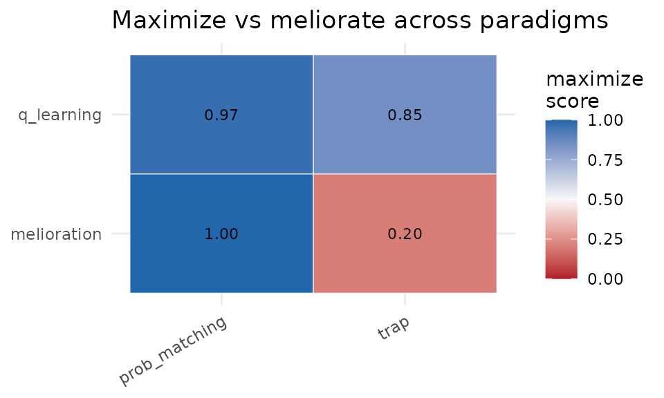

# Differentiating reward maximization from melioration

``` r
library(operantlunar)
```

## The question

Two accounts describe how choice tracks reinforcement. The **law of
effect** says behavior moves toward the action with the highest long-run
return: reward maximization. **Melioration** (the mechanism behind the
matching law) says behavior moves toward the action with the higher
*local* return, evaluated myopically. On many environments the two
coincide. They come apart only when choosing an option changes the local
returns, or when a smaller-sooner reward competes with a larger-later
one.

`operantlunar` holds the learning skeleton fixed and swaps the update
rule, then runs each rule through operant paradigms designed to separate
the two accounts.

## The rule library

Every rule plugs into every paradigm through a registry:

``` r
names(agent_registry())
#>  [1] "q_learning"          "sarsa"               "expected_sarsa"     
#>  [4] "double_q"            "boltzmann_q"         "actor_critic"       
#>  [7] "model_based"         "melioration"         "melioration_rate"   
#> [10] "win_stay_lose_shift"
sapply(c("q_learning", "melioration", "melioration_rate", "win_stay_lose_shift"), agent_kind)
#>          q_learning         melioration    melioration_rate win_stay_lose_shift 
#>         "maximizer"        "meliorator"        "meliorator"         "heuristic"
```

``` r
ag <- make_agent("double_q", n_actions = 2L, horizon = 30000L)
```

## The melioration trap

The trap is the canonical dissociation: option A pays more, but the more
A is chosen the worse both options become. The rate-maximizing
allocation differs from the matching allocation.

``` r
tr <- melioration_trap()
tr$optimum()
#> $x_opt
#> [1] 0.4
#> 
#> $rate_opt
#> [1] 0.48
tr$matching_point()
#> $x_match
#> [1] 0.8
#> 
#> $rate_match
#> [1] 0.4
```

A reward maximizer settles near the optimum; gradient-bandit melioration
is pulled to the matching point and earns less. (Full run elided for
build speed.)

``` r
melioration_trap_experiment(n_steps = 60000)
```

## More paradigms

``` r
prob_matching_experiment(probs = c(0.75, 0.25))   # matching vs exclusive choice
self_control_experiment()                          # delay discounting
drl_experiment()                                   # low-rate responding
devaluation_experiment()                           # habit vs goal-directed
```

Probability matching is produced by the rate-tracking rule, not by the
gradient-bandit melioration (which maximizes on a stationary bandit).
Self-control and reinforcer devaluation cleanly separate myopic from
far-sighted control.

## The differentiation matrix

The capstone scores each rule on each paradigm in `[0, 1]`, where 1 is
reward-maximizing and lower values indicate matching or suboptimal
behavior. A small two-rule, two-paradigm version runs here; the full
instrument uses more rules, more paradigms, and a larger step budget.

``` r
dm <- differentiation_matrix(
  rules = c("q_learning", "melioration"),
  paradigms = c("prob_matching", "trap"),
  n_steps = 5000
)
dm$wide
#> # A tibble: 2 × 3
#>   rule        prob_matching  trap
#>   <chr>               <dbl> <dbl>
#> 1 q_learning          0.971 0.85 
#> 2 melioration         0.999 0.200
plot_differentiation_matrix(dm)
```



## Function approximation and LunarLander

Tabular state binning is the binding constraint on the LunarLander
comparison. Hashed tile coding with linear semi-gradient agents removes
it, and a generic Gymnasium adapter extends the same comparison to other
environments. These require a configured Python via
[`lunar_setup()`](https://sondreskarsten.github.io/operantlunar/reference/lunar_setup.md)
and are not run here.

``` r
lunar_setup("/usr/bin/python3")
differentiate_fa("CartPole-v1", n_train = 300)
differentiate_gym("FrozenLake-v1", make_kwargs = list(is_slippery = FALSE))
```

## Reading the results honestly

No single paradigm proves a rule maximizes; each isolates one failure
mode of myopic control. The trap and self-control catch gradient-bandit
melioration; probability matching catches the rate-tracking rule;
differential reinforcement of low rates separates annealed-exploration
value rules from persistently stochastic ones. The matrix is a
fingerprint, not a scalar verdict.
